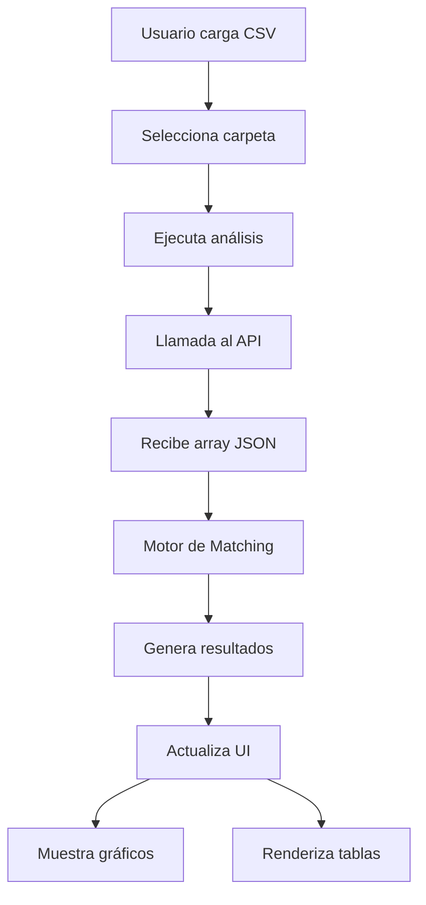

# 🏦 Sistema de Análisis de Transacciones Bancarias

## 📋 Tabla de Contenidos
- [Descripción General](#-descripción-general)
- [Características Principales](#-características-principales)
- [Arquitectura del Sistema](#-arquitectura-del-sistema)
- [Instalación y Configuración](#-instalación-y-configuración)
- [Guía de Usuario](#-guía-de-usuario)
- [Documentación Técnica](#-documentación-técnica)
- [API y Integración](#-api-y-integración)
- [Resolución de Problemas](#-resolución-de-problemas)

---

## 🎯 Descripción General

Sistema web profesional para análisis y validación de transacciones bancarias que compara datos de archivos CSV con respuestas de APIs bancarias. La aplicación utiliza algoritmos inteligentes de matching para identificar equivalencias entre transacciones y proporciona visualizaciones interactivas de los resultados.

### 🎪 Características Destacadas
- **Análisis Invertido**: Usa transacciones del API como base de comparación
- **Selector de Carpeta Optimizado**: Solo extrae rutas sin cargar archivos
- **Motor de Matching Inteligente**: Múltiples criterios con tolerancias configurables
- **Visualización Profesional**: Gráficos interactivos y tablas dinámicas
- **Gestión de Imágenes**: Modal para visualizar comprobantes bancarios
- **Diseño Responsive**: Compatible con desktop, tablet y móvil

---

## ✨ Características Principales

### 🔄 **1. Análisis Invertido**
- **Enfoque**: Cada transacción del API busca equivalencias en datos CSV
- **Algoritmos**: Matching multicriteria (valor, fecha, referencia)
- **Tolerancias**: Configurables para diferentes niveles de precisión
- **Resultados**: Clasificación en exactas, parciales y sin equivalencia

### 📁 **2. Selector de Carpeta Optimizado**
```javascript
// Solo extrae la ruta, no carga archivos
const folderPath = this.extractFolderPath(selectedFiles);
// Resultado: "D:/talentotechia/python/images/bancolombia/"
```
- **Eficiencia**: No carga contenido innecesario
- **Formateo**: Automático con slash al final
- **Validación**: Verifica selección antes del análisis

### 📊 **3. Visualización de Datos**
- **Gráfico Circular**: Distribución de equivalencias con porcentajes
- **KPIs Dinámicos**: Tarjetas de resumen en tiempo real
- **Tablas Interactivas**: Filtros y búsqueda avanzada
- **Exportación**: Resultados en formato CSV

### 🖼️ **4. Gestión de Imágenes**
- **Modal Profesional**: Visualización de comprobantes bancarios
- **Descarga Directa**: Imágenes individuales
- **Manejo de Errores**: Placeholders automáticos
- **Responsive**: Adaptable a cualquier dispositivo

### 🎨 **5. Diseño e Interfaz**
- **Tema Corporativo**: Paleta azul profesional empresarial
- **Animations**: Transiciones suaves y feedback visual
- **Accessibility**: Navegación por teclado y ARIA labels
- **Mobile-First**: Diseño responsive desde móvil

---

## 🏗️ Arquitectura del Sistema

### 📂 **Estructura del Proyecto**
```
análisis-bancario/
├── index.html              # Interfaz principal
├── css/
│   └── style.css          # Estilos profesionales
├── js/
│   ├── main.js           # Lógica principal + UI
│   ├── matching-engine.js # Motor de análisis
│   ├── charts.js         # Gestión de gráficos
│   └── utils.js          # Utilidades y helpers
├── test-folder-selector.html # Prueba del selector
├── README.md             # Documentación
└── docs/
    └── documentacion-tecnica.pdf
```

### 🔧 **Componentes Principales**

#### **AnalysisBancario** (main.js)
```javascript
class AnalysisBancario {
    - csvData: Array          // Datos CSV cargados
    - apiData: Array          // Respuesta del API
    - analysisResults: Array  // Resultados del matching
    - selectedFolderPath: String // Ruta de carpeta seleccionada
}
```

#### **MatchingEngine** (matching-engine.js)
```javascript
class MatchingEngine {
    static THRESHOLDS = {
        EXACT_MATCH: 0.95,        // 95% de confianza para exacta
        PARTIAL_MATCH: 0.7,       // 70% para parcial
        DATE_TOLERANCE_DAYS: 3,   // ±3 días tolerancia
        VALUE_TOLERANCE_PERCENT: 0.05 // ±5% tolerancia valor
    }
}
```

#### **ChartManager** (charts.js)
```javascript
class ChartManager {
    - charts: Object          // Instancias de Chart.js
    + createDistributionChart() // Gráfico circular
    + exportChart()          // Exportar como imagen
}
```

### 🔄 **Flujo de Datos**


---

## 🚀 Instalación y Configuración

### 📋 **Prerrequisitos**
- Navegador web moderno (Chrome, Firefox, Safari, Edge)
- Servidor web local (opcional para desarrollo)
- API bancario configurado (para producción)

### 🔧 **Instalación Local**
```bash
# 1. Clonar o descargar el proyecto
git clone <repository-url>

# 2. Navegar al directorio
cd análisis-bancario

# 3. Abrir con servidor local (opcional)
python -m http.server 8000
# o
npx serve .

# 4. Acceder en navegador
http://localhost:8000
```

### ⚙️ **Configuración del API**
Editar `js/main.js` para conectar con API real:
```javascript
async callAnalysisAPI(folderPath) {
    return await fetch('/api/analyze', {
        method: 'POST',
        headers: { 
            'Content-Type': 'application/json',
            'Authorization': 'Bearer YOUR_TOKEN' // Si requiere auth
        },
        body: JSON.stringify({ 
            csvData: this.csvData,
            folderPath: folderPath 
        })
    }).then(response => response.json());
}
```

---

## 👤 Guía de Usuario

### 📤 **1. Cargar Datos CSV**
1. **Arrastra y suelta** un archivo CSV o **haz clic en "Seleccionar Archivo"**
2. **Formato requerido**: `Fecha,Descripción,Referencia,Valor`
3. **Ejemplo**:
   ```
   Fecha,Descripción,Referencia,Valor
   09/03/2025,PAGO PSE,trzxfks2oeec,6000
   09/03/2025,PAGO PSE,trwciqdnwaec,20000
   ```

### 📁 **2. Seleccionar Carpeta de Imágenes**
1. **Haz clic** en "📁 Seleccionar Carpeta"
2. **Navega** hasta la carpeta que contiene las imágenes
3. **Selecciona** cualquier archivo dentro de la carpeta
4. **La ruta** se formatea automáticamente: `D:/ruta/carpeta/`

### 🔍 **3. Ejecutar Análisis**
1. **Verifica** que ambos datos estén cargados
2. **Haz clic** en "🔍 Ejecutar Análisis"
3. **Observa** el progreso en las notificaciones
4. **Revisa** los resultados en tiempo real

### 📊 **4. Interpretar Resultados**

#### **Tarjetas de KPI**
- **Equivalencias Exactas**: Coincidencias con 95%+ de confianza
- **Equivalencias Parciales**: Coincidencias con 70-95% de confianza  
- **Sin Equivalencia**: Coincidencias con <70% de confianza

#### **Gráfico Circular**
- **Verde**: Equivalencias exactas
- **Amarillo**: Equivalencias parciales
- **Rojo**: Sin equivalencia
- **Centro**: Total de transacciones

#### **Tabla Detallada**
- **Estado**: Clasificación del matching
- **Datos API**: Información de la transacción bancaria
- **Datos CSV**: Registro equivalente encontrado
- **Confianza**: Porcentaje de similitud (0-100%)
- **Imagen**: Botón para ver comprobante

### 🖼️ **5. Visualizar Imágenes**
1. **Haz clic** en "👁️ Ver Imagen" en cualquier fila
2. **Se abre** modal con comprobante bancario
3. **Información** contextual (comprobante, fecha, valor)
4. **Descarga** directa con botón "📥 Descargar"

### 📄 **6. Exportar Resultados**
1. **Haz clic** en "📄 Exportar CSV"
2. **Se descarga** archivo con todos los resultados
3. **Formato**: Compatible con Excel y otros programas

---

## 🔧 Documentación Técnica

### 🧠 **Motor de Matching**

#### **Criterios de Evaluación**
```javascript
const criteria = {
    value: this.evaluateValueMatch(apiValue, csvValue),     // 40% peso
    date: this.evaluateDateMatch(apiDate, csvDate),        // 30% peso  
    reference: this.evaluateReferenceMatch(apiTx, csvTx)   // 30% peso
};
```

#### **Algoritmo de Valores**
```javascript
// Comparación de valores absolutos
const absApiValue = Math.abs(apiValue);
const absCsvValue = Math.abs(csvValue);

// Tolerancia del 5%
const tolerance = Math.max(absApiValue, absCsvValue) * 0.05;
const difference = Math.abs(absApiValue - absCsvValue);

if (difference <= tolerance) {
    score = 1 - (difference / Math.max(absApiValue, absCsvValue));
}
```

#### **Algoritmo de Fechas**
```javascript
// Tolerancia de ±3 días
const diffDays = Math.abs(date1 - date2) / (1000 * 60 * 60 * 24);

if (diffDays === 0) return 1.0;
if (diffDays <= 3) return Math.max(0.7, 1 - (diffDays / 3) * 0.2);
```

#### **Algoritmo de Referencias**
```javascript
// Extracción de números
const numbers1 = extractNumbers(reference1);
const numbers2 = extractNumbers(reference2);

// Similitud textual (Levenshtein)
const similarity = calculateSimilarity(text1, text2);
```

### 📊 **Gestión de Gráficos**

#### **Configuración Chart.js**
```javascript
const config = {
    type: 'doughnut',
    data: {
        labels: ['Exactas', 'Parciales', 'Sin Equivalencia'],
        datasets: [{
            data: [exactMatches, partialMatches, noMatches],
            backgroundColor: ['#10b981', '#f59e0b', '#ef4444']
        }]
    },
    options: {
        responsive: true,
        cutout: '60%',
        plugins: {
            legend: { position: 'bottom' }
        }
    }
};
```

#### **Plugin de Texto Central**
```javascript
plugins: [{
    beforeDraw: function(chart) {
        // Dibuja total en el centro del donut
        const total = data.reduce((a, b) => a + b, 0);
        ctx.fillText(total, centerX, centerY);
    }
}]
```

### 🔐 **Seguridad y Validación**

#### **Validación CSV**
```javascript
static isValidCSV(content) {
    const lines = content.trim().split('\n');
    return lines.every(line => {
        const fields = line.split(';');
        return fields.length === 4; // Fecha;Desc;Ref;Valor
    });
}
```

#### **Validación API Response**
```javascript
static validateAPIResponse(data) {
    return Array.isArray(data) && data.every(item => 
        item.comprobante && 
        item.fecha && 
        typeof item.valor === 'number' &&
        item.producto_destino
    );
}
```

#### **Sanitización de Datos**
```javascript
static normalizeString(str) {
    return str.toLowerCase()
             .normalize('NFD')
             .replace(/[\u0300-\u036f]/g, '') // Quitar acentos
             .replace(/[^\w\s]/gi, '')        // Quitar especiales
             .trim();
}
```

---

## 🌐 API y Integración

### 📤 **Formato de Entrada**

#### **Datos CSV Esperados**
```javascript
{
    fecha: "09/03/2025",
    descripcion: "PAGO PSE", 
    referencia: "trzxfks2oeec",
    valor: 6000
}
```

#### **Ruta de Carpeta**
```javascript
{
    folderPath: "D:/talentotechia/python/images/bancolombia/"
}
```

### 📥 **Formato de Respuesta API**

#### **Estructura Esperada**
```json
[
    {
        "comprobante": "trzxfks2oeec",
        "fecha": "2025-09-03 17:09",
        "image": "D:/talentotechia/python/images/bancolombia/ban.jpeg",
        "producto_destino": {
            "cuenta": "655-141729-99",
            "nombre": "drogueria el carruse", 
            "tipo": "ahorros"
        },
        "producto_origen": {
            "cuenta": "",
            "tipo": "ahorros"
        },
        "valor": 6000
    }
]
```

#### **Campos Requeridos**
- `comprobante`: String - Identificador único de la transacción
- `fecha`: String - Fecha y hora en formato ISO o similar
- `valor`: Number - Monto de la transacción (positivo o negativo)
- `producto_destino`: Object - Información del destinatario
- `image`: String - Ruta completa al archivo de imagen

#### **Campos Opcionales**
- `producto_origen`: Object - Información del origen
- Cualquier otro campo adicional será ignorado

### 🔌 **Endpoints de Integración**

#### **POST http://localhost:5000/process_path**
```javascript
// Request
{
    "path": "D:/talentotechia/python/images/test/"    // Ruta de carpeta con slash
}

// Response  
{
    "status": "success",
    "data": [...],              // Array de transacciones
    "message": "Análisis completado"
}
```

#### **Códigos de Respuesta**
- `200`: Análisis exitoso
- `400`: Datos de entrada inválidos
- `404`: Carpeta no encontrada
- `500`: Error interno del servidor

---

## 🐛 Resolución de Problemas

### ❌ **Errores Comunes**

#### **"Formato de CSV inválido"**
**Causa**: El archivo no tiene el formato correcto
**Solución**: 
```
✅ Correcto: Fecha,Descripción,Referencia,Valor
❌ Incorrecto: Fecha;Descripcion;Referencia;Valor
```

#### **"Por favor selecciona una carpeta"**
**Causa**: No se ha seleccionado carpeta o la ruta no termina en `/`
**Solución**: 
- Usar el botón "📁 Seleccionar Carpeta"
- Verificar que aparezca la ruta completa

#### **"Error durante el análisis"**
**Causa**: Problema con la respuesta del API
**Solución**:
- Verificar conexión a internet
- Revisar formato de respuesta del API
- Consultar logs del navegador (F12)

### 🔍 **Debug y Logs**

#### **Activar Logs Detallados**
```javascript
// En main.js, cambiar nivel de logging
console.log = (msg) => {
    const timestamp = new Date().toISOString();
    console.info(`[${timestamp}] ${msg}`);
};
```

#### **Inspeccionar Datos**
```javascript
// Inspeccionar datos CSV cargados
console.table(window.bankingAnalyzer.csvData);

// Inspeccionar respuesta del API
console.table(window.bankingAnalyzer.apiData);

// Inspeccionar resultados del matching
console.table(window.bankingAnalyzer.analysisResults);
```

### 🌐 **Compatibilidad de Navegadores**

| Navegador | Versión Mínima | Soporte |
|-----------|----------------|---------|
| Chrome    | 88+            | ✅ Completo |
| Firefox   | 85+            | ✅ Completo |
| Safari    | 14+            | ✅ Completo |
| Edge      | 88+            | ✅ Completo |

#### **Funciones Específicas**
- `webkitdirectory`: Soportado en todos los navegadores modernos
- `Chart.js`: Compatible con IE11+
- `Fetch API`: Polyfill requerido para IE11

### 📱 **Responsive Issues**

#### **En Móviles**
- Usar orientación horizontal para tablas
- Scroll horizontal habilitado automáticamente
- Modal se ajusta al viewport

#### **En Tablets**
- Layout de dos columnas se mantiene
- Gráficos se redimensionan automáticamente
- Touch gestures soportados

---

## 🔧 Configuración Avanzada

### ⚙️ **Personalizar Tolerancias**
```javascript
// En matching-engine.js
static THRESHOLDS = {
    EXACT_MATCH: 0.98,        // Más estricto (98%)
    PARTIAL_MATCH: 0.8,       // Más permisivo (80%)
    DATE_TOLERANCE_DAYS: 5,   // ±5 días
    VALUE_TOLERANCE_PERCENT: 0.1 // ±10%
};
```

### 🎨 **Personalizar Colores**
```css
/* En style.css */
:root {
    --primary-blue: #1e40af;     /* Azul más oscuro */
    --success-color: #059669;    /* Verde más intenso */
    --warning-color: #d97706;    /* Amarillo más cálido */
    --error-color: #dc2626;      /* Rojo más fuerte */
}
```

### 📊 **Agregar Nuevos Gráficos**
```javascript
// En charts.js
static createNewChart(data) {
    const ctx = document.getElementById('newChart');
    return new Chart(ctx, {
        type: 'bar',  // Tipo de gráfico
        data: data,   // Datos
        options: {    // Configuración
            responsive: true
        }
    });
}
```

---

## 📞 Soporte y Contribución

### 📧 **Contacto**
- **Email**: soporte@análisis-bancario.com
- **Documentación**: [Ver PDF Técnico](docs/documentacion-tecnica.pdf)
- **Issues**: Reportar problemas en el repositorio

### 🤝 **Contribuir**
1. Fork del repositorio
2. Crear rama de feature: `git checkout -b feature/nueva-funcionalidad`
3. Commit cambios: `git commit -m 'Agregar nueva funcionalidad'`
4. Push a la rama: `git push origin feature/nueva-funcionalidad`
5. Crear Pull Request

### 📄 **Licencia**
Este proyecto está bajo la Licencia MIT. Ver `LICENSE` para más detalles.

---

## 🏆 Créditos

**Desarrollado por**: Equipo de Desarrollo GenSpark  
**Versión**: 2.0.0  
**Fecha**: Diciembre 2024  
**Tecnologías**: HTML5, CSS3, JavaScript ES6+, Chart.js

---

*¡Gracias por usar el Sistema de Análisis de Transacciones Bancarias! 🏦✨*